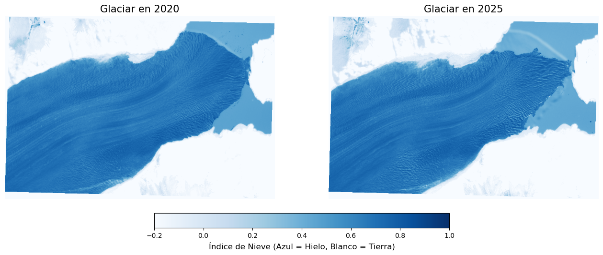

# Glacier Retreat Analysis via Sentinel-2 Imagery

This project develops an automated Python pipeline to quantify ice surface loss using satellite imagery from the **Sentinel-2 (ESA)** mission. While this analysis focuses specifically on the **Perito Moreno Glacier (Argentina)**, the system is designed to be replicable for any glacier worldwide by simply replacing the Area of Interest (AOI) GeoJSON file.

> 🇪🇸 [Versión en Español](./README.es.md)

## Visual Results (Case Study: Perito Moreno)

*NDSI (Normalized Difference Snow Index) visualization. Deep blue highlights areas with high snow/ice presence, allowing for the observation of glacier front variations between 2020 and 2025.*
## Impact & Conclusions
The analysis quantified a net ice surface loss of **2.70 km²** over just 5 years. To visualize this magnitude globally:

* The lost ice area is equivalent to roughly **80% of Central Park**.
* The lost surface is larger than the entire country of **Monaco** (2.02 km²).
* It represents approximately **378 professional soccer fields**.
  
## Technical Challenges & Solutions
As a Data Science student, I applied mathematical and statistical tools for raster data processing:
* **Resolution Standardization:** Implemented bilinear *upsampling* to match 20m bands with the 10m resolution of visible bands.
* **Scalability:** The code is location-independent; it processes any pair of Sentinel-2 images as long as they cover the coordinates defined in the input GeoJSON.
* **Spectral Index (NDSI):** Used to accurately discriminate ice from clouds and bare soil.

  $$NDSI = \frac{Green - SWIR}{Green + SWIR}$$

* **Optimization:** Utilized `MemoryFile` to process subsets in volatile memory, significantly improving pipeline efficiency.

## How to Run This Project Locally

### 1. Data Acquisition (Selection Criteria)
To ensure a valid comparison unaffected by seasonal variations or measurement errors, follow these criteria in the [Copernicus Browser](https://dataspace.copernicus.eu/browser/):

* **Seasonal Consistency:** For Southern Hemisphere glaciers, it is crucial to choose images from the **austral summer** (January-March) for both dates. This ensures we are measuring actual ice and not seasonal winter snow cover.
* **Cloud Filter:** Ideally, search for images with **<10% cloud cover**. If unavailable, the margin can be extended to **20% maximum**, verifying that clouds do not obstruct the glacier front.
* **Product Type:** Always download in **L2A (Surface Reflectance)** format to ensure atmospherically corrected values.
* **Setup:** Unzip the `.SAFE` folder into `data/raw/`.

### 2. Installation & Execution
1. **Clone the repository:**
   ```bash
   git clone https://github.com/FernandaVil/Glaciar-Analysis-Sentinel2.git

2. **Install dependencies:**
    ```bash
    pip install -r requirements.txt

3. **Run:** Open `Analisis_Glaciar_Final.ipynb` in VS Code or Jupyter. To analyze a different glacier, simply replace `data/map.geojson` with a new one generated at [geojson.io](https://geojson.io/).

 ## Project Structure
 * `Analisis_Glaciar_Final.ipynb` : Main notebook with documented workflow.
 * `data/`: Area of Interest (AOI) in GeoJSON format.
 * `output/`: Generated comparative maps.
 * `requirements.txt`: Required libraries for execution.

---
*Project developed as a personal exploration in Remote Sensing and Geospatial Analysis.*
